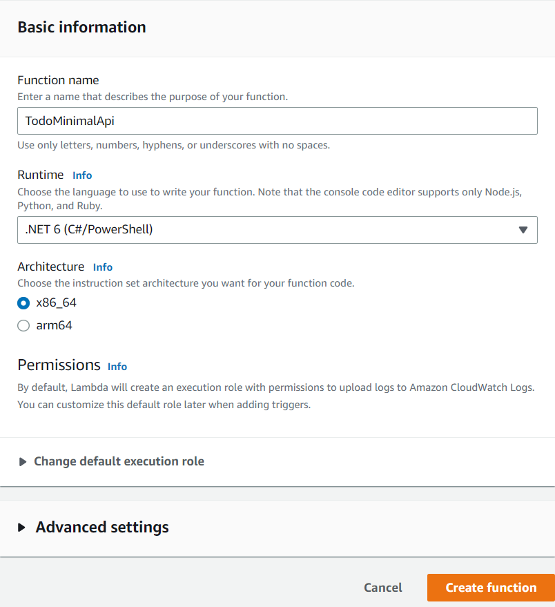
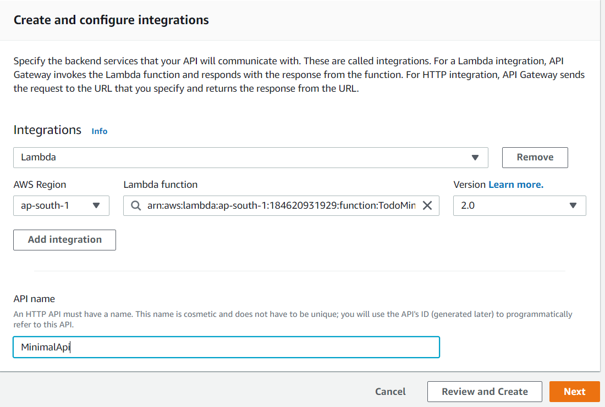

# Building microservices using .NET 6 Minimal APIs and AWS Lambda

## Create Minimal API application using .NET 6

1) Open command terminal and check the version of installed .NET SDK. Run the command `dotnet --version` and confirm the version is `6.x` only. 
2) Create a new web application project by running the following command.

    ```dotnetcli
    dotnet new web -n TodoApi
    ```

3) Add the required nuget packages to the project by running the following command.
    
    ```dotnetcli
    cd .\TodoApi\
    dotnet add package Microsoft.EntityFrameworkCore.InMemory --version 6.0.12
	dotnet add package Microsoft.AspNetCore.Diagnostics.EntityFrameworkCore --version 6.0.12
	dotnet add package Swashbuckle.AspNetCore --version 6.4.0
    ```

4) Create a folder `Models` in the project directory and add a class file - `Todo.cs` - to it. Add the following code to it.
    ```csharp
    namespace TodoApi.Models;

    public class Todo
    {
        public int Id { get; set; }
        public string? Name { get; set; }
        public bool IsComplete { get; set; }
    }
    ```

5) Create another folder named `Data` in the project folder and add a data context class - `TodoDb.cs` - to it.
    ```csharp    
    using Microsoft.EntityFrameworkCore;
    using TodoApi.Models;
    
    namespace TodoApi.Data;
    
    public class TodoDb : DbContext
    {
        public TodoDb(DbContextOptions<TodoDb> options)
            : base(options) { }
    
        public DbSet<Todo> Todos => Set<Todo>();
    }
    ```

6) Configure the DbContext service in the `Program.cs` file. Also configure the *Swagger* documentation service in the services collection.

    ```csharp
    using Microsoft.EntityFrameworkCore;
    using TodoApi.Data;
    using TodoApi.ApisExtensions;
    var builder = WebApplication.CreateBuilder(args);
    
    //Register Database services
    builder.Services.AddDbContext<TodoDb>(opt => opt.UseInMemoryDatabase("TodoList"));
    builder.Services.AddDatabaseDeveloperPageExceptionFilter();
    
    //Register Swagger service
    if (app.Environment.IsDevelopment())
    {
        app.UseSwagger();
        app.UseSwaggerUI(c =>
        {
            c.SwaggerEndpoint("/swagger/v1/swagger.json", $"{builder.Environment.ApplicationName} v1");
            c.RoutePrefix = "";
        });
    }   
    ```

7) Create a folder `Apis` in the project root folder and add `TodoApiExtensions.cs` file. Add the following code for minimal api to it.
    ```csharp    
    using TodoApi.Data;
    using TodoApi.Models;
    using System.Linq;
    using Microsoft.EntityFrameworkCore;
    
    namespace TodoApi.ApisExtensions;
    
    public static class TodoApiExtensions
    {
        public static WebApplication MapTodoApi(this WebApplication app)
        {
    
            app.MapGet("/api/todos", async (TodoDb db) =>
                await db.Todos.ToListAsync())
                .Produces<Todo>(StatusCodes.Status200OK)
                .WithName("GetAllTodos")
                .WithTags("TodoGroup");
    
            app.MapGet("/api/todos/complete", async (TodoDb db) =>
                await db.Todos.Where(t => t.IsComplete).ToListAsync())
                .Produces<Todo>(StatusCodes.Status200OK)
                .WithName("GetCompletedTodos")
                .WithTags("TodoGroup");
    
            app.MapGet("/api/todos/{id}", async (int id, TodoDb db) =>
                await db.Todos.FindAsync(id) is Todo todo
                        ? Results.Ok(todo)
                        : Results.NotFound())
                        .Produces<Todo>(StatusCodes.Status200OK)
                        .Produces(StatusCodes.Status404NotFound)
                        .WithName("GetTodoById")
                        .WithTags("TodoGroup"); 
    
            app.MapPost("/api/todos", async (Todo todo, TodoDb db) =>
            {
                db.Todos.Add(todo);
                await db.SaveChangesAsync();
                return Results.Created($"/todos/{todo.Id}", todo);
            })
            .Produces<Todo>(StatusCodes.Status201Created)
            .WithName("AddTodoItem")
            .WithTags("TodoGroup");
    
            app.MapPut("/api/todos/{id}", async (int id, Todo inputTodo, TodoDb db) =>
            {
                var todo = await db.Todos.FindAsync(id);
    
                if (todo is null) return Results.NotFound();
    
                todo.Name = inputTodo.Name;
                todo.IsComplete = inputTodo.IsComplete;
    
                await db.SaveChangesAsync();
    
                return Results.NoContent();
            })
            .Produces<Todo>(StatusCodes.Status204NoContent)
            .Produces(StatusCodes.Status404NotFound)
            .WithName("UpdateTodoItem")
            .WithTags("TodoGroup");
    
            app.MapDelete("/api/todos/{id}", async (int id, TodoDb db) =>
            {
                if (await db.Todos.FindAsync(id) is Todo todo)
                {
                    db.Todos.Remove(todo);
                    await db.SaveChangesAsync();
                    return Results.Ok(todo);
                }
    
                return Results.NotFound();
            })
            .Produces<Todo>(StatusCodes.Status200OK)
            .Produces(StatusCodes.Status404NotFound)
            .WithName("DeleteTodoItem")
            .WithTags("TodoGroup");
    
            return app;
        }
    }
    ```

8) Configure the minimal api to the web application pipeline. Add the following line to `Program.cs` file for configuring the minimal Api routes.
    ```csharp
    //Add Apis
    app.MapTodoApi();
    ```

9) Now, We can add the configuration for AWS Lambda hosting. Run the following command to add the nuget package for Lambda hosting.
    ```dotnetcli
    dotnet add package Amazon.Lambda.AspNetCoreServer.Hosting
    ```

10) Add a call to `AddAWSLambdaHosting` in your application when the services are being defined for the application. The argument for `AddAWSLambdaHosting` is the event source for the Lambda function. This can be an `API Gateway REST or HTTP API`, or an `Application Load Balancer`.

    ```csharp
    //Register LamdaHosting Service
    builder.Services.AddAWSLambdaHosting(LambdaEventSource.HttpApi);
    ```

    > [!NOTE]
    > When the ASP.NET Core project is run locally, `AddAWSLambdaHosting` does nothing, allowing the normal .NET Kestrel web server to handle the local experience. When running in Lambda, `AddAWSLambdaHosting` swaps out Kestrel with `Amazon.Lambda.AspNetCoreServer` allowing Lambda and API Gateway to act as the web server instead of Kestrel. Since Minimal APIs take advantage of top-level statements, `AddAWSLambdaHosting` also starts the Lambda runtime client.

10) The completed `Program.cs` file look like the following.
    ```csharp
    using Microsoft.EntityFrameworkCore;
    using TodoApi.Data;
    using TodoApi.ApisExtensions;
    var builder = WebApplication.CreateBuilder(args);
    
    //Register Database services
    builder.Services.AddDbContext<TodoDb>(opt => opt.UseInMemoryDatabase("TodoList"));
    builder.Services.AddDatabaseDeveloperPageExceptionFilter();
    
    //Register Swagger service
    if (app.Environment.IsDevelopment())
    {
        app.UseSwagger();
        app.UseSwaggerUI(c =>
        {
            c.SwaggerEndpoint("/swagger/v1/swagger.json", $"{builder.Environment.ApplicationName} v1");
            c.RoutePrefix = "";
        });
    }
    
    //Register LamdaHosting Service
    builder.Services.AddAWSLambdaHosting(LambdaEventSource.HttpApi);
    
    var app = builder.Build();
    
    //Add Swagger middleware
    app.UseSwagger();
    app.UseSwaggerUI(c => {
        c.SwaggerEndpoint("/swagger/v1/swagger.json", $"{builder.Environment.ApplicationName} v1");
        c.RoutePrefix="";
    });
    
    //Add Apis
    app.MapTodoApi();
    
    app.Run();
    ```

## Deploy application to AWS Lambda
1) Open the AWS management console, and navigate to AWS Lambda dashboard.
2) Create a new Lambda instance, and specify the function name as `TodoMinimalApi` and runtime as `.NET 6`.
    
    

3) After the Lambda is created, we need to deploy the application to it. For that run the following command from the minimal api project folder location to publish the project into `publish` folder.
    ```csharp
    dotnet publish -c Release --self-contained false -r linux-x64 -o publish
    ```

4) Now, zip the contents of the `/publish` directory and upload it with `Code > Code source > Upload From > .zip file` in the AWS lambda console.
    
    

5) Update the `Handler` name in the `Code > Runtime Settings`. Click on the *Edit* button and update the value to `TodoApi`. For .NET 6 minimal api projects with top level statements, we need to specify only the assembly name as the handler value.

    


## Add Http routes for Lambda with Amazon API Gateway

1) Open the Amazon API Gateway console and create a new API gateway. Select the API type as `Http ` and add the integration with `Lambda`. Choose the Lambda - `TodoMinimalApi` - from the dropdownlist. Specify the API name as `Minimal Api`. Click on the `next`.

    

2) Add the routes for mapping the Minimal Api endpoints. Click on the `Next`.

    

3) Select the stage name as `$default`. Click on `Next`. Review and create the API gateway.

4) Copy the Api gateway endpoint and test with an REST api client.
    
    

    


